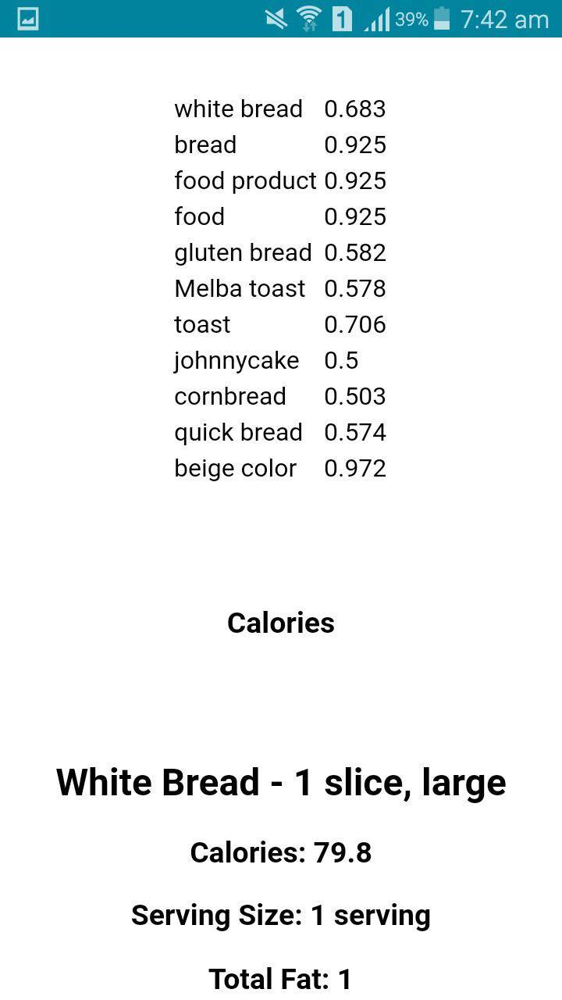

# Create a calorie counter mobile app using Watson Visual Recognition

In this developer journey, we will create a calorie counter mobile app using Apache Cordova, Node.JS and Watson Visual Recognition.This mobile application analyzes the captured image(food) using Watson Visual Recognition and extracts nutritional information.


## Flow

1. The user deploys the server application to IBM Bluemix.

2. The user interacts with the Mobile App.

3. When the user captures the image, the server application uses the Watson Visual Recognition service to analyze the images and Nutritionix API to provide nutritional information.

## With Watson

Want to take your Watson app to the next level? Looking to leverage Watson Brand assets? Join the [With Watson](https://www.ibm.com/watson/with-watson/) program which provides exclusive brand, marketing, and tech resources to amplify and accelerate your Watson embedded commercial solution.

## Included components

* Watson Visual Recognition: Visual Recognition understands the contents of images - visual concepts tag the image, find human faces, approximate age and gender, and find similar images in a collection.

* Nutritionix API: The largest verified database of nutrition information.

## Featured Technologies

* Mobile: Systems of engagement are increasingly using mobile technology as the platform for delivery.

* Node.js: An open-source JavaScript run-time environment for executing server-side JavaScript code.


## Prerequisite

* Obtain a Nutritionix API Key: For this project, you'll need an API Key from Nutritionix, so that app can have access to nutritional information of analysed image. Instructions for obtaining a key can be found [here](https://developer.nutritionix.com/). *Make note of the API key for later use in your mobile application.*

## Steps

Use the following steps to deploy the application
- Deploy the Server Application
- Update the Mobile Application
- Run the Mobile Application

### Deploy the Server Application

### a) Using the Deploy to Bluemix button
Clicking on the button below creates a Bluemix DevOps Toolchain and deploys this application to Bluemix. The `manifest.yml` file [included in the repo] is parsed to obtain the name of the application, configuration details, and the list of services that should be provisioned. For further details on the structure of the `manifest.yml` file, see the [Cloud Foundry documentation](https://docs.cloudfoundry.org/devguide/deploy-apps/manifest.html#minimal-manifest).

[](https://bluemix.net/deploy?repository=https://github.com/RiyaMRoy04/CalorieCounterApp.git)

Once deployment to Bluemix is completed, you can view the deployed application and services from your bluemix account.
*Make note of the URL for later use in mobile application*
 
 ### Update the Mobile Application
 
 
 1. Edit APP URL(Bluemix-server-url), APP ID(Nutritionix APP ID) and APP KEY(Nutritionix APP Key) in www/js/index.js
 
 ### Run the Mobile Application
 
 As prerequisite, you need to have Node.js and cordova module installed. Follow steps below to install
 
 1. Download and install [Node.js](https://nodejs.org/en/download/). On installation you should be able to invoke node and npm on your command line.
 
 2. Install the cordova module using npm utility of Node.js. The cordova module will automatically be downloaded by the npm utility. Follow the steps [here](https://cordova.apache.org/docs/en/latest/guide/cli/#installing-the-cordova-cli) to install the corodva module.
 
 *All subsequent commands need to be run within the project's directory, or any subdirectories:* 
 
 i.e. here it will be cd CalorieCounterApp/mobile
 
 3. Add the platforms that you want to target your app. We will add the 'android' platform and ensure they get saved to config.xml and package.json.
      ```
      cordova platform add android
      ```
 Check if you satisfy requirements for building the platform [here](https://cordova.apache.org/docs/en/latest/guide/cli/#install-pre-requisites-for-building)
 
 4. For the app to access device-level features, you need to add plugins:
   
      ```
      cordova plugin add org.apache.cordova.camera

      cordova plugin add org.apache.cordova.file-transfer
      ```
 5. Run the following command to build the project for android platform:
   
      ```
      cordova build android
      ```
 6. Plug the mobile device into your computer and test the app directly by issuing the command
 
      ```
      cordova run android
      ```
 
  ## Sample Output
  
    
  
  ## Watch the video
  
  ## Links
  
  
  ## Troubleshooting
  
  ## License
  
  Apache 2.0
  
  
